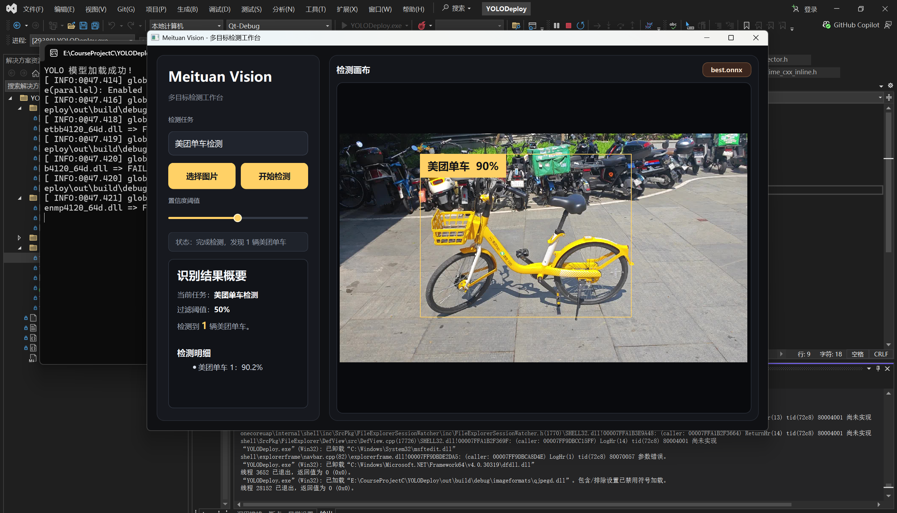

# Meituan Vision - 美团单车目标检测系统

> 基于 C++、Qt、OpenCV 与 ONNX Runtime 的美团单车专项目标检测桌面应用。

## 项目简介

本项目是一个面向美团单车场景的目标检测部署项目。项目从 YOLO 官方轻量级模型部署出发，逐步完成了 C++ 推理环境搭建、图像预处理、模型推理、后处理与可视化，并进一步集成 Qt 图形化界面，形成一个可以上传图片、运行检测、展示检测框和识别结果的桌面应用原型。

当前版本的主要目标是识别图片中的美团单车，使用的模型`best.onnx`是用本人在校园内拍摄的一百五十多张图片作为数据，在Roboflow平台上进行数据标注整理获得数据集，然后利用Google Colab云端算力进行训练筛选得到的，模型平均准确率大概为57%，在本次的课程大作业展示中本人认为已经足够。界面采用“左侧检测任务面板 + 右侧检测画布”的工作台布局，并预留了后续扩展多种目标检测任务的入口。

## 功能特性

- 支持 C++ 部署 YOLO ONNX 模型。
- 支持 OpenCV 图像读取、预处理与可视化辅助。
- 支持 Letterbox 等比例缩放预处理，减少图像变形。
- 支持 ONNX Runtime 执行模型推理。
- 支持 YOLO 输出张量解析、置信度过滤与 NMS 后处理。
- 支持 Qt 图形化界面上传图片并展示检测结果。
- 支持美团单车专项检测模型 `best.onnx`。
- 支持检测框、标签、置信度与检测数量展示。
- 支持置信度滑块动态过滤显示结果。
- 预留多目标检测任务选择入口，便于后续扩展其他模型或类别。

## 界面预览





## 技术栈

- C++17
- Qt Widgets
- OpenCV
- ONNX Runtime
- YOLO / YOLOv8
- CMake
- Ninja
- vcpkg

## 项目结构

```text
YOLODeploy/
├── CMakeLists.txt              # CMake 构建配置
├── CMakePresets.json           # Qt/CMake 预设配置
├── CMakeUserPresets.json       # 本机 Qt Kit 预设配置
├── data/                       # 测试图片
├── include/
│   ├── types.h                 # 检测结果数据结构
│   ├── yolo_detector.h         # YOLO 检测器接口
│   └── visualizer.h            # 可视化模块预留文件
├── models/                     # 模型文件目录
│   └── best.onnx               # 当前美团单车检测模型（需自行放置）
├── src/
│   ├── main.cpp                # Qt 应用入口
│   ├── mainwindow.cpp          # 主窗口逻辑、UI 样式、检测结果绘制
│   ├── mainwindow.h            # 主窗口声明
│   ├── mainwindow.ui           # Qt Designer UI 文件
│   ├── yolo_detector.cpp       # 预处理、推理、后处理逻辑
│   └── visualizer.cpp          # 可视化模块预留文件
└── README.md
```

## 环境依赖

本项目当前主要在 Windows 环境下开发和测试。

推荐环境：

- Windows 10/11
- Visual Studio 2022 MSVC x64
- Qt 6.x MSVC 2022 64-bit
- CMake 3.15+
- Ninja
- OpenCV
- ONNX Runtime x64
- vcpkg x64-windows

## 模型文件

当前程序默认加载：

```text
E:/CourseProjectC/YOLODeploy/models/best.onnx
```

本项目使用的 `best.onnx` 是基于 YOLOv8n 进行迁移学习得到的美团单车专项检测模型。原始模型基座为 Ultralytics 提供的 `yolov8n.pt`，训练数据由本人在校园真实场景中拍摄并上传至 Roboflow 进行人工标注，随后导出为 YOLOv8 数据集格式，在 Google Colab 的 GPU 环境中完成训练，并最终导出为 ONNX 格式用于 C++ 项目部署。

### 数据来源

训练数据主要来自校园内真实拍摄的共享单车图片，覆盖教学楼、图书馆、食堂、宿舍楼、道路边、人行道、绿化带附近等常见场景。拍摄时尽量包含不同距离、角度、光照、遮挡和背景复杂度，以提升模型在真实环境中的泛化能力。

数据集中包含：

- 正样本：包含美团单车的校园场景图片。
- 负样本：不包含美团单车的图片，例如普通自行车、道路、建筑、绿化等背景，用于降低误检率。
- 多目标样本：同一张图片中存在多辆美团单车。
- 遮挡样本：单车被人、其他车辆、草丛、建筑物等部分遮挡。
- 远景样本：画面中目标较小的美团单车。
- 近景样本：车身、车把、车篮、车轮等较大比例出现在画面中的样本。

实际共使用了153张图片，其中训练集，验证集，测试集比例分别为 7:2:1。

### 标注方式

数据标注在 Roboflow 平台完成，标注格式为目标检测常用的 Bounding Box 矩形框。标注时只标注美团单车，不标注普通私人自行车、摩托车或其他非目标车辆。

标注原则：

- 每一辆可辨认的美团单车单独画框。
- 多辆车重叠时，各自独立标注，允许检测框重叠。
- 被遮挡或被画面裁切的单车，只标注画面中可见部分。
- 不含美团单车的图片作为负样本保留，不绘制任何标注框。
- 标注框尽量紧贴目标可见区域的上下左右边界。

### 类别定义

当前模型仅包含 1 个检测类别：

```yaml
names:
  0: meituan_bike
```

在 Qt 界面中，该类别显示为：

```text
美团单车
```

### 训练方法

训练在 Google Colab 中完成，使用 Ultralytics YOLOv8 训练接口。数据集从 Roboflow 导出为 YOLOv8 格式，并通过 Roboflow API 下载到 Colab 环境中。

训练基础代码如下：

```python
!pip install ultralytics

from ultralytics import YOLO

model = YOLO("yolov8n.pt")

results = model.train(
    data=f"{dataset.location}/data.yaml",
    epochs=50,
    imgsz=640,
    batch=16,
    lr0=0.01,
    plots=True
)
```

主要训练参数说明：

- `model = YOLO("yolov8n.pt")`：使用 YOLOv8n 预训练模型作为迁移学习起点。
- `epochs=50`：训练 50 轮。
- `imgsz=640`：训练输入尺寸为 640，与 C++ 部署代码中的输入尺寸保持一致。
- `batch=16`：每次训练使用 16 张图片。
- `lr0=0.01`：初始学习率。
- `plots=True`：保存训练过程图表，便于观察 loss 和 mAP 等指标变化。

### ONNX 导出

训练完成后，选择训练过程中验证效果最好的权重文件 `best.pt`，并在 Colab 中导出为 ONNX 格式：

```python
from ultralytics import YOLO

model = YOLO("runs/detect/train/weights/best.pt")
model.export(format="onnx", dynamic=False)
```

导出后得到：

```text
best.onnx
```

随后将该文件放入本地项目目录：

```text
YOLODeploy/models/best.onnx
```

### 模型效果

本模型在 Google Colab 环境中训练完成，训练设备为 Tesla T4 GPU，训练轮数为 50，输入尺寸为 640。训练完成后，选择验证集上表现最好的 `best.pt` 权重，并导出为 `best.onnx` 用于 C++ 项目部署。

训练数据集划分情况如下：

```text
训练集：107 张图片，其中 11 张为背景图
验证集：31 张图片，其中 6 张为背景图
验证集目标实例数：157
类别数：2
主要目标类别：shared_bike
```

训练配置如下：

```text
模型基座：yolov8n.pt
训练轮数：50
输入尺寸：640
Batch Size：16
优化器：AdamW
实际学习率：0.001667
训练设备：Google Colab Tesla T4
训练耗时：约 0.035 小时
导出格式：ONNX
ONNX 输出形状：1 x 6 x 8400
ONNX 文件大小：约 11.7 MB
```

最终验证结果如下：

```text
Precision: 0.562
Recall: 0.554
mAP50: 0.571
mAP50-95: 0.302
```

类别 `shared_bike` 的验证结果如下：

```text
Images: 25
Instances: 157
Precision: 0.562
Recall: 0.554
mAP50: 0.571
mAP50-95: 0.302
```

推理速度参考：

```text
Preprocess: 0.2 ms/image
Inference: 2.0 ms/image
Postprocess: 2.1 ms/image
```

从训练日志可以看到，模型在前期 mAP 较低，随着训练轮数增加逐渐收敛。后期 `mAP50` 稳定在约 `0.57` 左右，说明模型已经能够学习到美团单车的基本视觉特征，但由于数据量仍然较小、场景复杂度有限，模型精度还有继续提升空间。后续可以通过增加更多不同场景、光照、距离、遮挡和负样本数据来进一步优化模型表现。

由于模型文件较大，仓库中的 `.gitignore` 默认忽略 `*.onnx` 和 `*.pt` 文件。因此，克隆项目后需要自行准备模型文件，并放置到：

```text
YOLODeploy/models/best.onnx
```

## 构建与运行

### 1. 克隆项目

```powershell
git clone <your-repository-url>
cd YOLODeploy
```

### 2. 准备依赖

确保本机已安装并配置：

- Qt
- OpenCV
- ONNX Runtime
- CMake
- Ninja
- MSVC 编译器

当前 `CMakeLists.txt` 中仍包含部分本机绝对路径，例如：

```cmake
E:/CourseProjectC/vcpkg/installed/x64-windows
E:/CourseProjectC/onnxruntime-win-x64-1.24.4
```

如果你的项目目录或依赖目录不同，需要在 `CMakeLists.txt` 和 Qt CMake Preset 中修改为自己的路径。

### 3. 配置项目

如果使用 Qt Creator 或 Visual Studio，可以直接打开项目目录，选择 Qt 对应的 CMake Preset。

如果使用命令行，可参考：

```powershell
cmake --preset Qt-Debug
```

### 4. 编译项目

```powershell
cmake --build out/build/debug
```

### 5. 运行程序

编译完成后运行：

```powershell
out/build/debug/YOLODeploy.exe
```

运行后：

1. 点击“选择图片”。
2. 选择一张待检测图片。
3. 点击“开始检测”。
4. 通过置信度滑块调整显示结果。

## 版本演进

### v1.0

主要实现以下功能：

- 成功搭建 C++ 部署环境，集成 OpenCV 与 ONNX Runtime。
- 实现动态图像预处理，包括 Letterbox 算法。
- 成功部署 YOLO 官方轻量级模型 `yolov8n.onnx`。
- 实现包含 NMS 的完整后处理逻辑。
- 支持真实图片的 COCO 80 类别检测与可视化画框。

### v2.0

在 v1.0 的基础上，进一步实现以下功能：

- 集成 Qt Widgets 图形化用户界面。
- 支持通过界面上传本地图片并展示检测结果。
- 将通用 YOLO 检测模型升级为美团单车专项检测模型 `best.onnx`。
- 实现美团单车检测结果的图形化可视化。
- 优化检测框、标签、置信度信息和结果面板展示。
- 新增置信度滑块，支持动态过滤检测结果。
- 预留多目标检测任务选择入口，为后续扩展其他目标检测任务做准备。

### v3.0

基于之前的版本，优化 Qt 检测工作台界面与美团单车检测标注体验

- 重构主窗口 UI 布局，改为左侧检测任务面板 + 右侧检测画布的工作台结构
- 将检测任务文案统一为“美团单车检测”，画框标签从通用 Bike 改为“美团单车”
- 新增目标类型下拉框，为后续扩展多种目标检测任务预留入口
- 优化整体深色主题、按钮、任务选择框、状态栏、结果面板和模型标识样式
- 改进检测框标签显示，支持根据检测框显示尺寸动态调整字号和线宽
- 调整标签贴合逻辑，使标签优先贴在检测框上边缘，顶部空间不足时自动放入框内
- 优化结果面板字体层级和检测明细展示
- 自定义置信度滑块绘制，使用圆形手柄和高亮进度轨道，修复 QSS 下手柄显示为方块的问题

- 集成 Qt Widgets 图形化用户界面。

## 当前已知问题与优化方向

- `CMakeLists.txt` 和运行逻辑中存在本机绝对路径，迁移到其他电脑时需要手动修改。
- 模型输入输出名称、输出维度、类别数等仍有硬编码，后续可改为自动读取模型元信息。
- `YoloDetector` 中的 `Ort::Session` 当前仍使用裸指针，后续可改为智能指针或直接成员对象，提升资源管理安全性。
- 置信度滑块目前主要控制显示过滤，检测器内部仍有固定置信度阈值。
- `visualizer.h` 和 `visualizer.cpp` 目前是预留文件，后续可以将绘制逻辑从 `MainWindow` 中拆分出来。
- 当前主要支持图片检测，后续可扩展视频检测、摄像头实时检测和批量检测。
- 美团单车检测准确率仍取决于训练数据规模、标注质量和模型训练效果。

## 后续计划

- [ ] 清理并参数化本机依赖路径。
- [ ] 支持模型配置文件，便于切换不同检测任务。
- [ ] 支持多个目标类别和类别颜色映射。
- [ ] 支持检测结果导出，例如图片、JSON 或 CSV。
- [ ] 支持视频文件检测。
- [ ] 支持摄像头实时检测。
- [ ] 优化模型后处理逻辑，使其适配更多 YOLO 输出格式。
- [ ] 补充完整项目截图、演示视频和训练过程说明。

## 致谢

- YOLO / Ultralytics
- OpenCV
- ONNX Runtime
- Qt

## 许可证

仅用于课程学习与研究。
